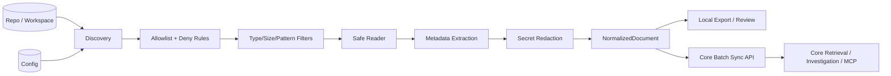

# OpsIncident-Collector

OpsIncident-Collector is a **deterministic evidence collection pipeline** for IncidentOps.

It discovers repository files under explicit policy, redacts secrets, extracts bounded metadata, normalizes source evidence into `NormalizedDocument`, and syncs sanitized batches to IncidentOps Core.

> Scope boundary: Collector performs collection, policy, redaction, metadata extraction, normalization, local export, and Core sync.
> IncidentOps Core performs canonical chunking, embeddings/indexing, retrieval, reranking, investigation, answer generation, citations, readiness, workflow runs, eval scoring, and product MCP.

Collector is not an AI investigator. It is the data-plane boundary. Dramatic, yes, but fewer leaks that way.

---

## End-to-end flow



MCP is not the ingestion path. Core MCP is the product MCP. Collector MCP/agent workflows, if used, are local/private operator tooling only.

---

## Quick start

```bash
opsincident-collector init
opsincident-collector doctor
opsincident-collector validate --config collector.yaml
opsincident-collector inspect --path ./some-folder
opsincident-collector sync --path ./some-folder --export jsonl --output out.jsonl
opsincident-collector sync --path ./some-folder --export api --project-id proj_123 --yes
opsincident-collector coverage --path ./some-folder --format json
opsincident-collector rag-report --path ./some-folder --format json
opsincident-collector validate-core-contract --api-url http://127.0.0.1:8001 --project-id proj_123
opsincident-collector benchmark --repo-url https://github.com/tiangolo/full-stack-fastapi-template.git --project-id proj_123 --output benchmark.json
opsincident-collector daemon run --config examples/local-daemon.yaml --max-cycles 1
opsincident-collector queue status --config collector.yaml
opsincident-collector validate-rag-pipeline --path ./some-folder --format json
```

Use local commands for development, security review, and deterministic CI checks. Product proof should sync into deployed Core.

---

## Current documentation

- [docs/README.md](docs/README.md): current documentation map and cleanup notes.
- [docs/collector-philosophy.md](docs/collector-philosophy.md): design philosophy and non-negotiable Collector/Core boundaries.
- [docs/architecture.md](docs/architecture.md): deterministic pipeline, responsibility split, and security path.
- [docs/core-contract.md](docs/core-contract.md): stable Collector/Core `NormalizedDocument` contract and upload expectations.
- [docs/production-usage.md](docs/production-usage.md): operator usage guide for inspection, sync, daemon, Docker, and validation modes.
- [docs/config-reference.md](docs/config-reference.md): configuration precedence, fields, and safe examples.
- [docs/security-model.md](docs/security-model.md): threat model, path policy, redaction, and telemetry controls.
- [docs/real-repo-benchmark.md](docs/real-repo-benchmark.md): repeatable real repository ingestion benchmark.

---

## Determinism and safety guarantees

- Explicit collection roots only; no free-roaming traversal.
- Stable path iteration and deterministic transforms.
- Deny rules apply before file reads.
- Binary, oversized, empty, unsupported, and denied files are skipped with reasons.
- Redaction happens before preview/export/sync boundaries.
- No logging of raw file content, token values, or secret values.
- `NormalizedDocument` remains the canonical Collector output.
- Core sync uses versioned batch APIs and safe diagnostics.

---

## Responsibility boundary

Collector owns:

- discovery
- path policy
- filtering
- secret redaction
- metadata extraction
- `NormalizedDocument`
- local export
- Core sync
- failed upload queue and retry/backoff
- source coverage and readiness diagnostics
- daemon health/metrics

Core owns:

- canonical chunking
- embeddings
- indexing
- retrieval
- reranking
- investigation
- answers
- citations
- readiness reports
- workflow runs
- eval scoring
- product MCP

If the Collector cannot reach Core, it may report coverage, readiness, and missing-data guidance. It must not invent incident diagnosis locally. Apparently evidence still matters.

---

## RAG readiness and eval seeds

```bash
opsincident-collector coverage --path ./service --format json
opsincident-collector rag-report --path ./service --format json
opsincident-collector eval-seed --path ./service --output eval_seed.jsonl
```

`coverage` reports missing recommended source categories. `rag-report` gives a deterministic diagnostic score based on logs, code, deploy history, incidents, runbooks, API docs, metadata, and hints. `eval-seed` writes deterministic JSONL cases from local evidence without using an LLM.

Validate Core compatibility without uploading data:

```bash
opsincident-collector validate-core-contract --api-url http://127.0.0.1:8001 --project-id proj_123
```

Use `--with-sample` only when you explicitly want to upload one tiny redacted contract-validation document.

---

## Real repo ingestion benchmark

`benchmark` is the repeatable proof that Collector and Core can process real backend repos without planting fake incidents:

```bash
opsincident-collector benchmark \
  --repo-url https://github.com/tiangolo/full-stack-fastapi-template.git \
  --project-id proj_123 \
  --output benchmarks/reports/full-stack-fastapi-template.json
```

The benchmark clones or copies a repo, inspects it, syncs it to Core, syncs the same content again, modifies one copied file, syncs again, runs `/v1/search`, and writes a JSON report.

The current serious scale target is Temporal. The first Temporal Azure run proved the cloud loop but exposed Go/proto coverage as the next bottleneck. That is the right kind of annoying: specific and measurable.

---

## Daemon and operations

The daemon runs periodic sync through the same deterministic pipeline used by `sync`:

- `/health` JSON endpoint with version, sync, Core reachability, state DB, and retry queue status.
- `/metrics` Prometheus text endpoint with sync counters, retry queue depth, uptime, and Core reachability.
- JSON structured daemon events such as `daemon_start`, `sync_cycle_complete`, and `core_unavailable`.
- Queue commands for failed upload visibility and retry.

```bash
opsincident-collector daemon run --config examples/local-daemon.yaml --max-cycles 1
opsincident-collector daemon health --host 127.0.0.1 --port 8686
opsincident-collector queue status --config examples/local-daemon.yaml --format json
opsincident-collector queue retry --config examples/production.yaml --format json
```

API upload in daemon mode is refused unless the config explicitly permits unattended upload with `daemon.allow_unattended_upload: true` or disables upload confirmation. Tokens still come from `INCIDENTOPS_TOKEN` or `api.token_env`; raw tokens do not belong in YAML.

---

## Docker

Base image:

```bash
docker build -t opsincident-collector:base .
```

Agent/daemon image:

```bash
docker build --build-arg INSTALL_TARGET=".[agent]" -t opsincident-collector:agent .
docker run --rm \
  -e INCIDENTOPS_API_URL=http://host.docker.internal:8001 \
  -e INCIDENTOPS_TOKEN=$INCIDENTOPS_TOKEN \
  -e INCIDENTOPS_PROJECT_ID=proj_123 \
  -v "$PWD/examples/daemon.yaml:/etc/opsincident-collector/collector.yaml:ro" \
  -v "$PWD/tests/fixtures/basic_project:/data/basic_project:ro" \
  -v "$PWD/.opsincident-collector:/var/lib/opsincident-collector" \
  opsincident-collector:agent \
  daemon run --config /etc/opsincident-collector/collector.yaml --max-cycles 1
```

---

## Testing

Preferred:

```bash
.venv/bin/python -m pytest -q
.venv/bin/python -m ruff check .
.venv/bin/python -m compileall opsincident_collector
```

Fallback:

```bash
python -m pytest -q
```
