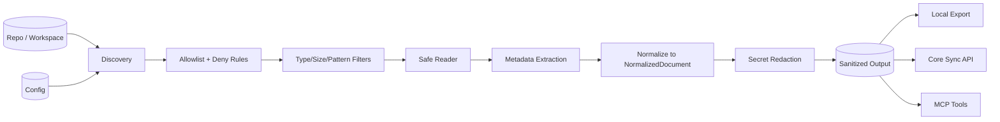
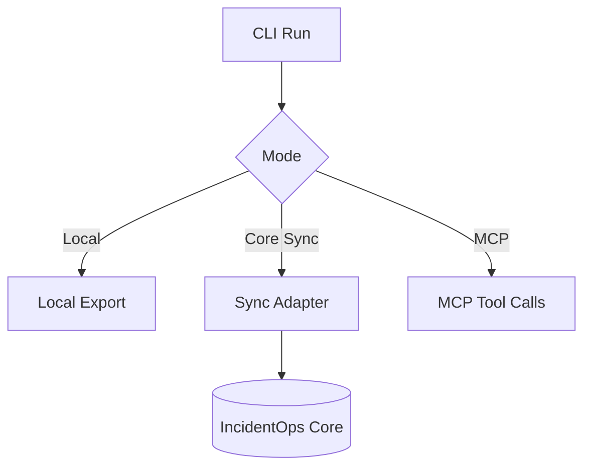

# OpsIncident-Collector

OpsIncident-Collector is a **deterministic evidence collection pipeline** for incident workflows.
It discovers repository files under explicit policy, normalizes them into `NormalizedDocument`, redacts secrets, and exports sanitized artifacts to local outputs and IncidentOps Core.

> Scope boundary: collector performs collection + policy + redaction + metadata. IncidentOps Core performs chunking, embeddings/indexing, retrieval, reranking, investigation, answer generation, citations, workflow runs, and eval scoring.

---

## End-to-end flow



---

## Quick start

1. Install dependencies.
2. Configure collection roots and path policy.
3. Run a local dry run and inspect redaction summaries.
4. Export locally or sync to Core.

```bash
python -m opsincident_collector --help
```

---

## Architecture map

- [docs/architecture.md](docs/architecture.md): full architecture, invariants, and diagrams.
- [docs/config-reference.md](docs/config-reference.md): config fields, precedence, and examples.
- [docs/security-model.md](docs/security-model.md): threat model and controls.
- [docs/operations.md](docs/operations.md): runbooks and operational checks.
- [docs/core-integration.md](docs/core-integration.md): Core sync contract and ownership boundary.
- [docs/mcp-server.md](docs/mcp-server.md): MCP surface and approval flow.
- [docs/server-deployment.md](docs/server-deployment.md): deployment topology and runtime hardening.
- [docs/local-only-mode.md](docs/local-only-mode.md): isolated/offline execution profile.
- [docs/langgraph-agent.md](docs/langgraph-agent.md): local workflow graph behavior.
- [docs/daemon.md](docs/daemon.md): daemon lifecycle and watch loop constraints.
- [docs/validate-rag-pipeline.md](docs/validate-rag-pipeline.md): deterministic validation and readiness checks.
- [docs/phase5-production-validation.md](docs/phase5-production-validation.md): production validation gates.

---


## Documentation merge notes

If you are merging documentation branches, apply this order to avoid conflicts:

1. Keep `docs/architecture.md` as the canonical system model.
2. Keep `README.md` as a navigation and quick-start layer only.
3. Resolve overlapping wording in favor of the dedicated `docs/*` page.
4. Re-run doc checks and render Mermaid previews before merge.

Conflict hot-spots from prior branches were usually `README.md` and:
`docs/mcp-server.md`, `docs/langgraph-agent.md`, and `docs/server-deployment.md`.

---

## Determinism and safety guarantees

- Explicit collection roots only (no free-roaming traversal).
- Stable path iteration and deterministic transforms.
- Redaction before preview/export/sync boundaries.
- No logging of raw file content, token values, or secret values.
- `NormalizedDocument` remains canonical collector output.

---

## Typical execution modes



---

## Testing

Preferred:

```bash
.venv/bin/python -m pytest -q
```

Fallback:

```bash
python -m pytest -q
```

