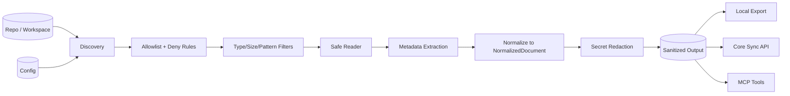
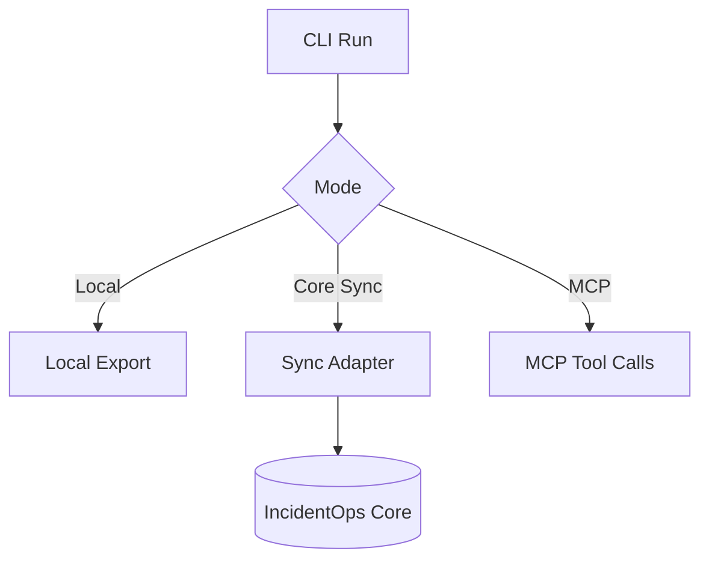

# OpsIncident-Collector

OpsIncident-Collector is a **deterministic evidence collection pipeline** for incident workflows.
It discovers repository files under explicit policy, normalizes them into `NormalizedDocument`,
redacts secrets, and exports sanitized artifacts to local outputs and IncidentOps Core.

> Scope boundary: Collector performs collection, policy, redaction, and metadata extraction.
> IncidentOps Core performs chunking, embeddings/indexing, retrieval, reranking, investigation,
> answer generation, citations, workflow runs, and eval scoring.

---

## End-to-end flow



---

## Quick start

```bash
opsincident-collector init
opsincident-collector doctor
opsincident-collector validate --config collector.yaml
opsincident-collector inspect --path ./some-folder
opsincident-collector sync --path ./some-folder --export jsonl --output out.jsonl
opsincident-collector sync --path ./some-folder --export api --project-id proj_123 --yes
opsincident-collector watch --path ./some-folder --export jsonl --output out.jsonl
opsincident-collector coverage --path ./some-folder --format json
opsincident-collector rag-report --path ./some-folder --format json
opsincident-collector eval-seed --path ./some-folder --output eval_seed.jsonl
opsincident-collector validate-core-contract --api-url http://127.0.0.1:8001 --project-id proj_123
opsincident-collector benchmark --repo-url https://github.com/nsidnev/fastapi-realworld-example-app.git --core-url http://127.0.0.1:8001 --project-id proj_123 --output benchmark.json
opsincident-collector mcp serve --config collector.yaml
opsincident-collector agent rag-readiness --path ./some-folder --format json
opsincident-collector agent onboard-source --path ./some-folder --export-target api --project-id proj_123
opsincident-collector agent sync-quality --path ./some-folder --project-id proj_123
opsincident-collector agent investigate --path ./some-folder --project-id proj_123 --query "Why did orders slow after deploy?"
opsincident-collector daemon run --config examples/local-daemon.yaml --max-cycles 1
opsincident-collector queue status --config collector.yaml
opsincident-collector validate-rag-pipeline --path ./some-folder --format json
```

---

## Architecture map

- [docs/architecture.md](docs/architecture.md): full architecture, invariants, and diagrams.
- [docs/config-reference.md](docs/config-reference.md): config fields, precedence, and examples.
- [docs/security-model.md](docs/security-model.md): threat model and controls.
- [docs/operations.md](docs/operations.md): runbooks and operational checks.
- [docs/core-integration.md](docs/core-integration.md): Core sync contract and ownership boundary.
- [docs/mcp-server.md](docs/mcp-server.md): MCP surface and approval flow.
- [docs/server-deployment.md](docs/server-deployment.md): deployment topology and runtime hardening.
- [docs/local-only-mode.md](docs/local-only-mode.md): isolated/offline execution profile.
- [docs/langgraph-agent.md](docs/langgraph-agent.md): local workflow graph behavior.
- [docs/daemon.md](docs/daemon.md): daemon lifecycle and watch loop constraints.
- [docs/validate-rag-pipeline.md](docs/validate-rag-pipeline.md): deterministic validation and readiness checks.
- [docs/phase5-production-validation.md](docs/phase5-production-validation.md): production validation gates.
- [docs/real-repo-benchmark.md](docs/real-repo-benchmark.md): real repository ingestion benchmark.

---

## Documentation merge notes

If you are merging documentation branches, apply this order to avoid conflicts:

1. Keep `docs/architecture.md` as the canonical system model.
2. Keep `README.md` as a navigation and quick-start layer only.
3. Resolve overlapping wording in favor of the dedicated `docs/*` page.
4. Re-run doc checks and render Mermaid previews before merge.

Conflict hot-spots from prior branches were usually `README.md` and:
`docs/mcp-server.md`, `docs/langgraph-agent.md`, and `docs/server-deployment.md`.

---

## Determinism and safety guarantees

- Explicit collection roots only; no free-roaming traversal.
- Stable path iteration and deterministic transforms.
- Redaction before preview/export/sync boundaries.
- No logging of raw file content, token values, or secret values.
- `NormalizedDocument` remains canonical collector output.

---

## Typical execution modes



---

## Testing

Preferred:

```bash
.venv/bin/python -m pytest -q
```

Fallback:

```bash
python -m pytest -q
```

Install agent dependencies with:

```bash
pip install "opsincident-collector[agent]"
docker build --build-arg INSTALL_TARGET=".[mcp,agent]" -t opsincident-collector:agent .
```

LangGraph does not call an LLM here, generate embeddings, use a vector database, or diagnose root
cause locally. Core remains responsible for RAG and investigation.

---

## RAG readiness and eval seeds

```bash
opsincident-collector coverage --path ./service --format json
opsincident-collector rag-report --path ./service --format json
opsincident-collector eval-seed --path ./service --output eval_seed.jsonl
```

`coverage` reports missing recommended source categories. `rag-report` gives a diagnostic score
based on logs, code, deploy history, incidents, runbooks, API docs, metadata, and hints.
`eval-seed` writes deterministic JSONL cases from local evidence without using an LLM.

Validate Core compatibility without uploading data:

```bash
opsincident-collector validate-core-contract --api-url http://127.0.0.1:8001 --project-id proj_123
```

Use `--with-sample` only when you explicitly want to upload one tiny redacted contract-validation
document.

---

## Real repo ingestion benchmark

`benchmark` is the repeatable proof that Collector and Core can process real backend repos without
planting fake incidents:

```bash
opsincident-collector benchmark \
  --repo-url https://github.com/tiangolo/full-stack-fastapi-template.git \
  --core-url http://127.0.0.1:8001 \
  --project-id proj_123 \
  --output benchmarks/reports/full-stack-fastapi-template.json
```

The benchmark clones or copies a repo, inspects it, syncs it to Core, syncs the same content again,
modifies one copied file, syncs again, runs `/v1/search`, and writes a JSON report. The report
includes files seen, skip reasons, unsupported extensions, documents normalized/synced, redaction
count, Core created/updated/skipped counters, chunks created, coverage warnings, duplicate chunks
after resync, changed-file update status, and sample search results.

Recommended first repos are listed in `benchmarks/repos.example.yaml`. Phase 1 proof reports live in
`benchmarks/reports/phase1-summary.md`.

---

## Daemon and operations

The daemon runs periodic sync through the same deterministic pipeline used by `sync`:

- `/health` JSON endpoint with version, sync, Core reachability, state DB, and retry queue status.
- `/metrics` Prometheus text endpoint with sync counters, retry queue depth, uptime, and Core reachability.
- JSON structured daemon events such as `daemon_start`, `sync_cycle_complete`, and `core_unavailable`.
- Queue commands for failed upload visibility and retry.

```bash
opsincident-collector daemon run --config examples/local-daemon.yaml --max-cycles 1
opsincident-collector daemon health --host 127.0.0.1 --port 8686
opsincident-collector queue status --config examples/local-daemon.yaml --format json
opsincident-collector queue retry --config examples/production.yaml --format json
```

API upload in daemon mode is refused unless the config explicitly permits unattended upload with
`daemon.allow_unattended_upload: true` or disables upload confirmation. Tokens still come from
`INCIDENTOPS_TOKEN` or `api.token_env`; raw tokens do not belong in YAML.

`validate-rag-pipeline` proves the Collector-to-Core path without pretending Core success:

```bash
opsincident-collector validate-rag-pipeline --path tests/fixtures/basic_project --format json
opsincident-collector validate-rag-pipeline \
  --path tests/fixtures/basic_project \
  --project-id proj_123 \
  --api-url http://127.0.0.1:8001 \
  --query "What evidence is available for investigation?" \
  --search \
  --investigate \
  --format json
```

By default it does not upload, search, or investigate. Add `--sync`, `--search`, or `--investigate`
explicitly for those Core operations.

---

## Docker

Base image:

```bash
docker build -t opsincident-collector:base .
```

MCP-capable image:

```bash
docker build --build-arg INSTALL_TARGET=".[mcp]" -t opsincident-collector:mcp .
```

Agent/daemon image:

```bash
docker build --build-arg INSTALL_TARGET=".[mcp,agent]" -t opsincident-collector:agent .
docker run --rm \
  -e INCIDENTOPS_API_URL=http://host.docker.internal:8001 \
  -e INCIDENTOPS_TOKEN=$INCIDENTOPS_TOKEN \
  -e INCIDENTOPS_PROJECT_ID=proj_123 \
  -v "$PWD/examples/daemon.yaml:/etc/opsincident-collector/collector.yaml:ro" \
  -v "$PWD/tests/fixtures/basic_project:/data/basic_project:ro" \
  -v "$PWD/.opsincident-collector:/var/lib/opsincident-collector" \
  opsincident-collector:agent \
  daemon run --config /etc/opsincident-collector/collector.yaml --max-cycles 1
```

See [docs/security-model.md](docs/security-model.md), [docs/config-reference.md](docs/config-reference.md),
[docs/langgraph-agent.md](docs/langgraph-agent.md), [docs/daemon.md](docs/daemon.md),
[docs/operations.md](docs/operations.md), and [docs/validate-rag-pipeline.md](docs/validate-rag-pipeline.md).
