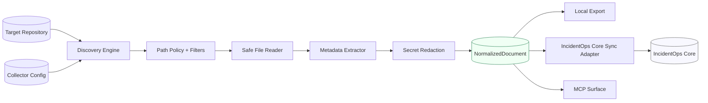
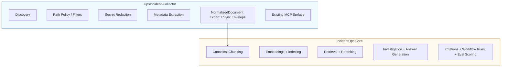
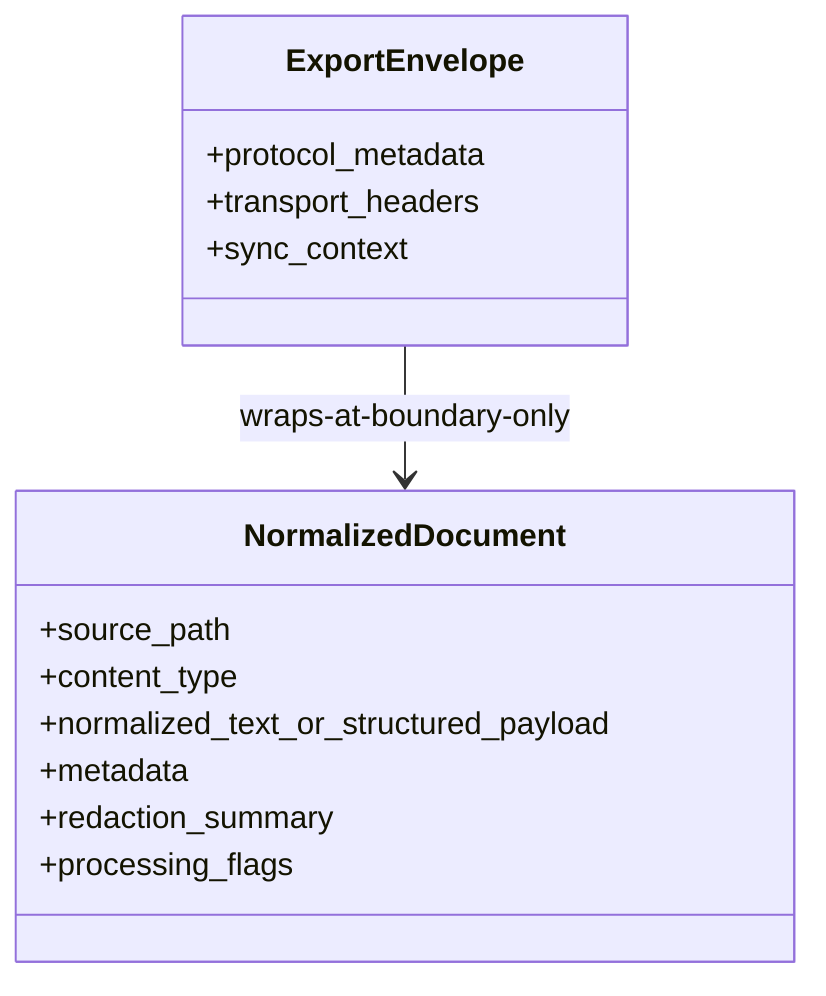
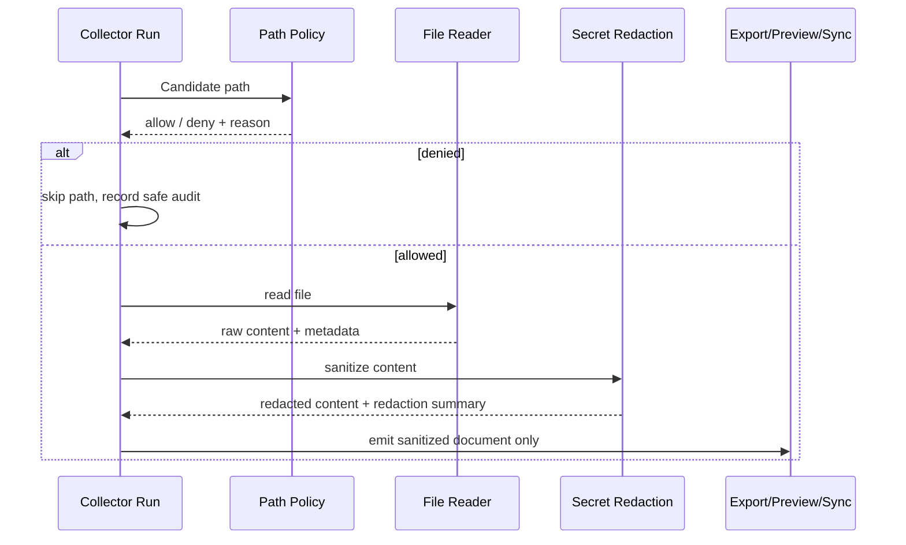

# Architecture

This document explains the **deterministic collector architecture** used in OpsIncident-Collector and how it fits with IncidentOps Core.

## Design goals

- Keep collection deterministic and reproducible for the same repository state and config.
- Keep `NormalizedDocument` as the canonical collector output.
- Enforce allowlist/denylist path policy at discovery time.
- Redact secrets before preview, export, or sync.
- Keep collector responsibilities separate from IncidentOps Core responsibilities.

---

## System context diagram



### How to read this diagram

1. **Discovery** scans only configured roots and candidate paths.
2. **Path policy and filters** remove disallowed paths before file reads.
3. **Safe reader + metadata extractor** build deterministic document state.
4. **Redaction** sanitizes sensitive values prior to any outward boundary.
5. The resulting **`NormalizedDocument`** fans out to local export, Core sync, and MCP-facing responses.

---

## Responsibility boundary graph



### Why this split matters

- Collector outputs remain portable and deterministic across environments.
- Core can evolve retrieval and reasoning independently without changing collection semantics.
- Security boundaries are cleaner: collector sanitizes inputs before any transfer.

---

## Deterministic collector pipeline (execution graph)

```mermaid
flowchart TD
    A[Start Collection Run] --> B[Load Config + Project Context]
    B --> C[Enumerate Candidate Paths]
    C --> D{Path Allowed?}
    D -- No --> D1[Skip + Audit Reason]
    D -- Yes --> E{File Matches Filters?}
    E -- No --> E1[Skip + Audit Reason]
    E -- Yes --> F[Read File]
    F --> G[Extract Metadata]
    G --> H[Normalize Structure]
    H --> I[Redact Secrets]
    I --> J[Build NormalizedDocument]
    J --> K[Emit to Boundary
(Local export / Core sync / MCP)]

    D1 --> L[Continue]
    E1 --> L
    K --> L
    L --> M{More Files?}
    M -- Yes --> D
    M -- No --> N[Finalize Run Summary]
```

### Determinism guarantees

- Input set is constrained by explicit roots and policies.
- Processing order is stable (path-based iteration).
- Transform stages are pure and reproducible for the same inputs.
- Secret handling happens before boundary emission.

---

## Data model map



### Data model notes

- `NormalizedDocument` is the canonical in-process and output model.
- Envelopes exist only at API/export boundaries and must not redefine canonical content.
- Metadata may include advisory hints for downstream systems, but not Core-owned canonical retrieval state.

---

## Security and policy path



### Security invariants

- No raw secret value may pass boundary interfaces.
- No raw file content or token values should be logged.
- Denied paths remain unread and are tracked via safe audit metadata.

---

## Related docs

- `docs/config-reference.md` for collector configuration controls.
- `docs/security-model.md` for threat model and controls.
- `docs/core-integration.md` for Core sync contract and boundaries.
- `docs/mcp-server.md` for MCP-exposed operations.
- `docs/langgraph-agent.md` for local graph workflow behavior.
