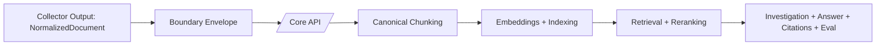

# Core Integration

This document describes the collector-to-Core boundary.

## Contract summary

Collector emits canonical `NormalizedDocument` and optional envelope metadata at transport boundaries.
Core receives sanitized documents and owns downstream reasoning/retrieval pipeline stages.

## Payload principles

- Canonical content is in `NormalizedDocument`.
- Envelope metadata is protocol/transport-only.
- Advisory hints (e.g., candidate citation/chunk notes) must not override Core canonical processing.

## Sync lifecycle

1. Build sanitized document batch.
2. Attach sync envelope metadata (project/run IDs, timestamps).
3. Send request with authentication.
4. Record safe telemetry (counts/status/latency only).
5. Retry transient failures with bounded policy.

## Error handling

- Never log raw payload body on error.
- Log only high-level request identifiers and counters.
- Preserve deterministic replay metadata for troubleshooting.
