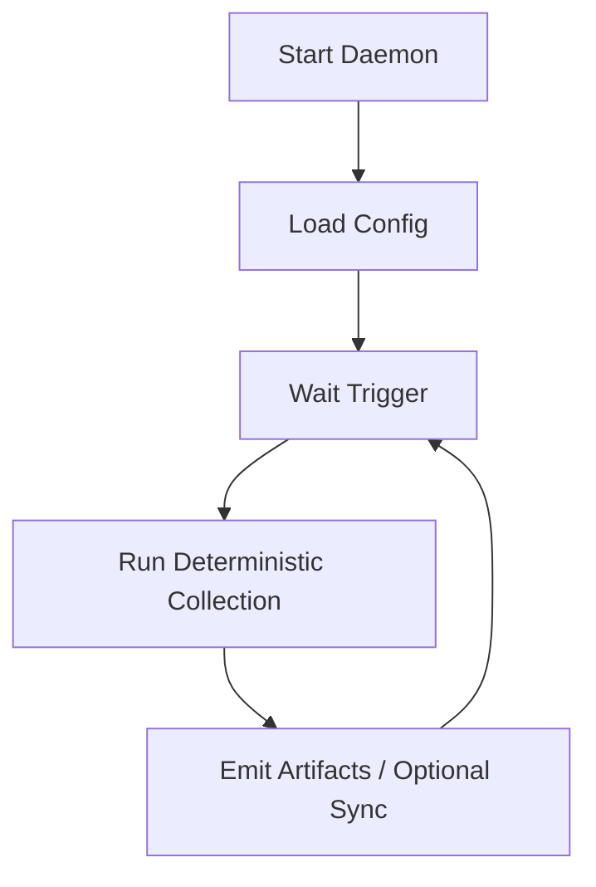

# Daemon Mode

Daemon mode runs continuous collection cycles on configured schedules/watchers.

## Lifecycle

## Trigger sources

- Timed interval.
- Filesystem watch events (within approved roots only).
- Manual CLI trigger.

## Reliability rules

- Serialize runs per project to avoid overlap.
- Drop/merge duplicate triggers within debounce window.
- Persist last-success + last-failure markers.
- Keep bounded retry for transient sync errors.

## Safety rules

- Apply same path policy and redaction pipeline as one-shot mode.
- Never broaden roots dynamically from watch events.
