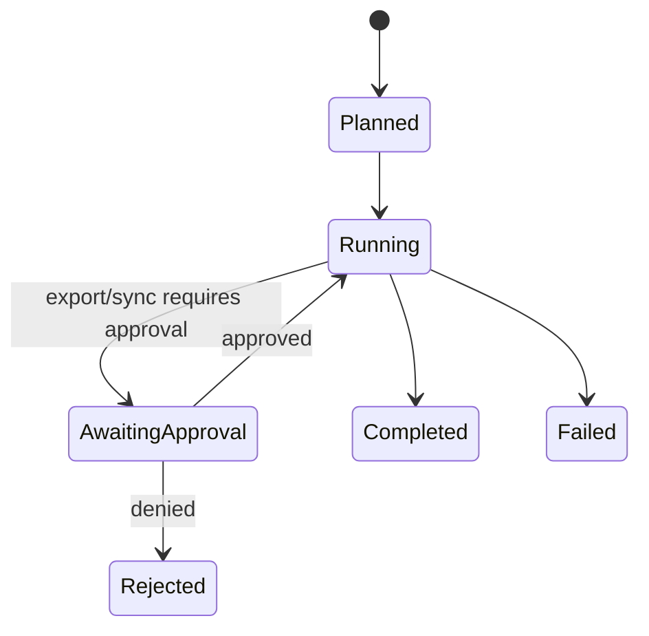

# Local Graph Agent Workflows

Local graph workflows coordinate deterministic collector actions; they do not perform Core-owned reasoning.

## Supported graph intents

- `collection_run`: deterministic discovery/filter/read/normalize/redact/export flow.
- `rag_readiness`: read-only offline readiness inspection and deterministic eval seed preview.
- `sync_review`: gated sync review with approval checkpoint.

## Graph state model

## Persistence

- Persist summary state transitions.
- Persist sanitized event timeline.
- Persist approval decisions with minimal metadata.

## Guardrails

- Never include raw file content in graph event logs.
- Never include token/secret values in approval payloads.
- Keep graph steps deterministic for same inputs and config.
