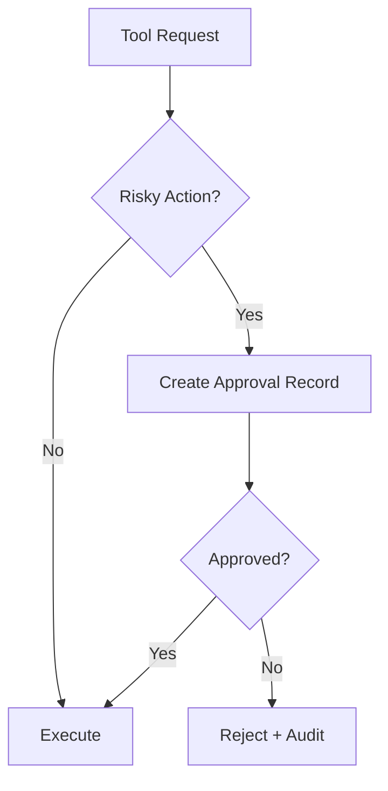

# MCP Server Surface

This document describes the existing MCP surface for deterministic collector operations.

## Principles

- MCP tools orchestrate existing collector capabilities only.
- No tool may bypass path policy or redaction guarantees.
- Approval gates are required for high-impact export/sync actions.

## Tool categories

1. **Discovery/preview**: inspect candidate scope and policy outcomes.
2. **Collection runs**: execute deterministic collection with configured profile.
3. **Export/sync**: emit local artifacts or push sanitized batches to Core.
4. **Operational status**: inspect run summary, counters, and failures.

## Approval flow graph

## Persisted records

- `graph_runs`: high-level run state and timestamps.
- `graph_events`: step-level lifecycle records.
- `graph_approvals`: approval decisions and actor metadata.

Records must remain sanitized and free of raw secrets/content.
