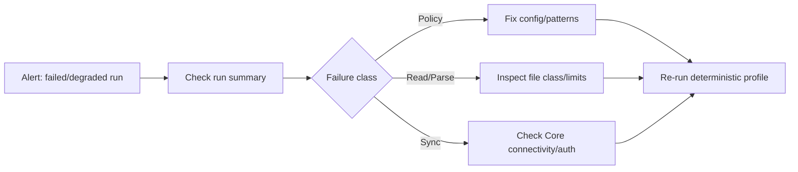

# Operations Runbook

## Daily checks

1. Verify collector service health/readiness.
2. Confirm recent run success rate and latency bands.
3. Review redaction summary trends.
4. Review sync failures and retry exhaustion.

## Incident triage flow



## Key metrics

- Files scanned / included / denied.
- Redactions by detector/category.
- Run duration and per-stage timing.
- Export/sync success rate.
- Approval turnaround for gated actions.

## Change management

- Stage config changes in local-only mode.
- Compare run summaries before production rollout.
- Promote with explicit approval + rollback plan.


## Merge conflict runbook

When documentation branches diverge:

1. Resolve conflicts in this order: `docs/architecture.md` -> domain docs in `docs/` -> `README.md`.
2. Preserve collector/Core responsibility boundaries exactly as defined in architecture/core integration docs.
3. Ensure no conflict resolution introduces policy bypass language (allowlist/denylist, redaction-before-boundary).
4. After resolution, run tests and a quick grep for conflict markers.

```bash
rg -n "^<<<<<<<|^=======|^>>>>>>>" README.md docs/*.md
```
