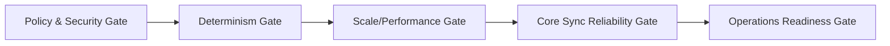

# Phase 5 Production Validation

This phase validates production rollout quality for collector + Core sync operations.

## Exit criteria

- Deterministic collector runs are stable across replay.
- Redaction controls pass security review.
- Core sync success meets SLO targets.
- Approval-gated actions are auditable.
- Operational runbooks validated in on-call simulation.

## Gate model

## Evidence package

- Run summaries for baseline + replay cohorts.
- Redaction report with sampled verification.
- Sync reliability report (latency, retries, failures).
- Approval audit report.
- Incident drill retrospective.
