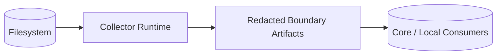

# Security Model

## Objectives

- Prevent secret leakage in logs, previews, exports, and sync traffic.
- Keep filesystem access constrained to configured policy.
- Preserve auditable, deterministic behavior during collection.

## Trust boundaries

## Controls

- Allowlist-first discovery roots.
- Deny-pattern and extension filtering before reads.
- Secret redaction before any external boundary.
- Sanitized telemetry only (no raw content/tokens).
- Safe audit trail for deny decisions.

## Threats considered

- Credential exposure through accidental export.
- Traversal into unmanaged directories.
- Oversized/binary payload instability.
- Leakage through debug or error logging.
