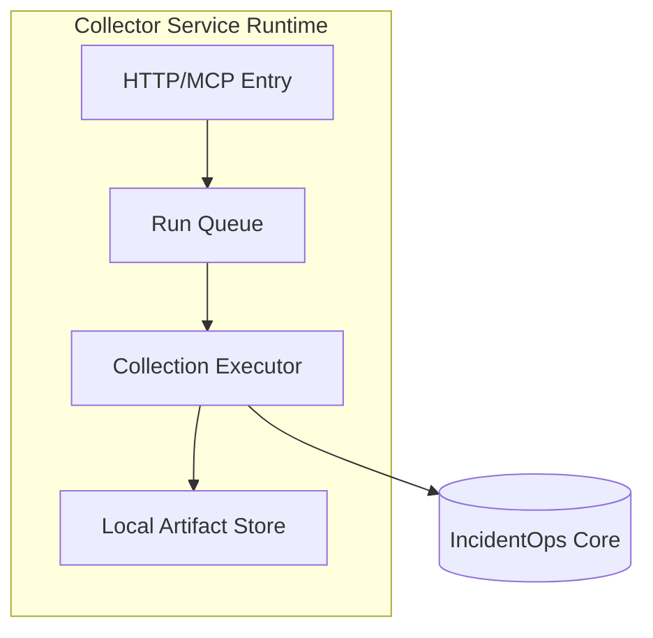

# Server Deployment

## Deployment topology

## Runtime requirements

- Python runtime pinned by project constraints.
- Read-only access to configured repository roots.
- Write access only to explicit artifact/output directories.
- Network egress limited to approved Core endpoints.

## Hardening checklist

- Run with least privilege service account.
- Mount secrets via secure env/secret manager; never print values.
- Set resource limits (CPU/memory/open files).
- Enable structured sanitized logs and rotation.
- Apply request timeout and retry limits for Core sync.

## Health model

- Liveness: process/event loop active.
- Readiness: config loaded, roots accessible, redaction initialized.
- Degraded: Core unavailable but local export path healthy.
