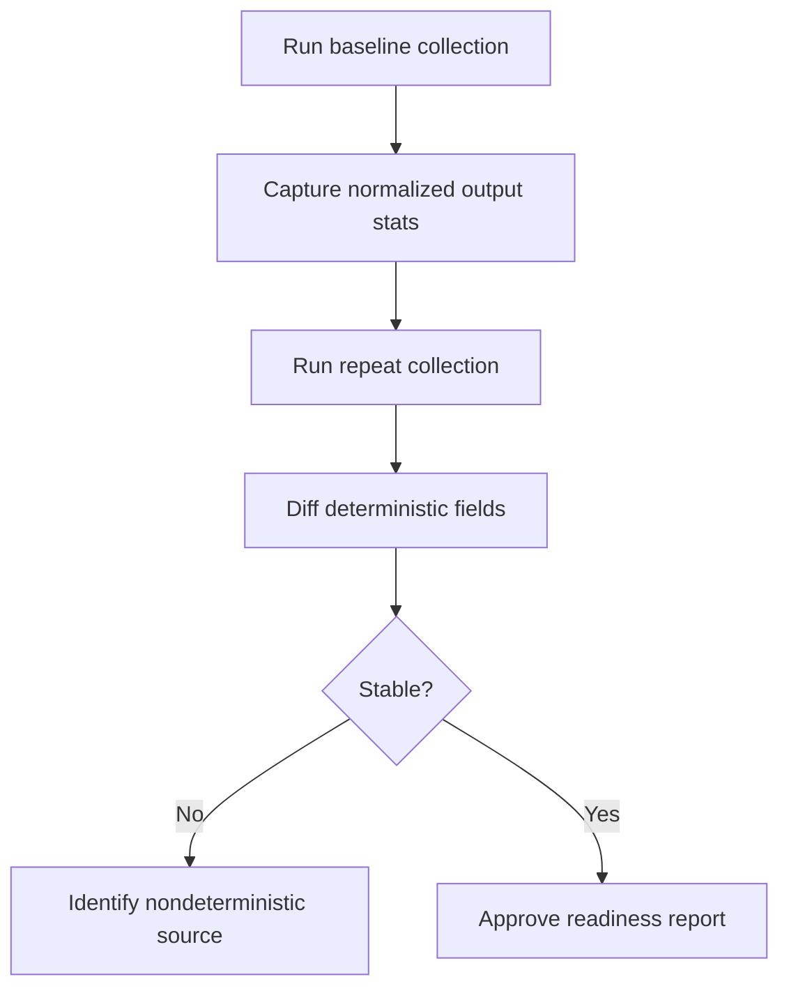

# Validate RAG Pipeline Readiness

Collector does not run canonical RAG; this guide validates whether collector outputs are ready for Core ingestion.

## Readiness dimensions

- Coverage: expected repositories/paths are included.
- Policy fidelity: deny/allow outcomes match policy intent.
- Redaction quality: sensitive values removed with acceptable precision/recall.
- Metadata usefulness: extracted metadata supports Core retrieval context.
- Determinism: repeated runs produce stable outputs for unchanged inputs.

## Validation graph

## Suggested checks

- Compare file inclusion sets across runs.
- Compare redaction counts/categories across runs.
- Verify no raw secrets in exported payload samples.
- Verify advisory metadata schema compatibility.
